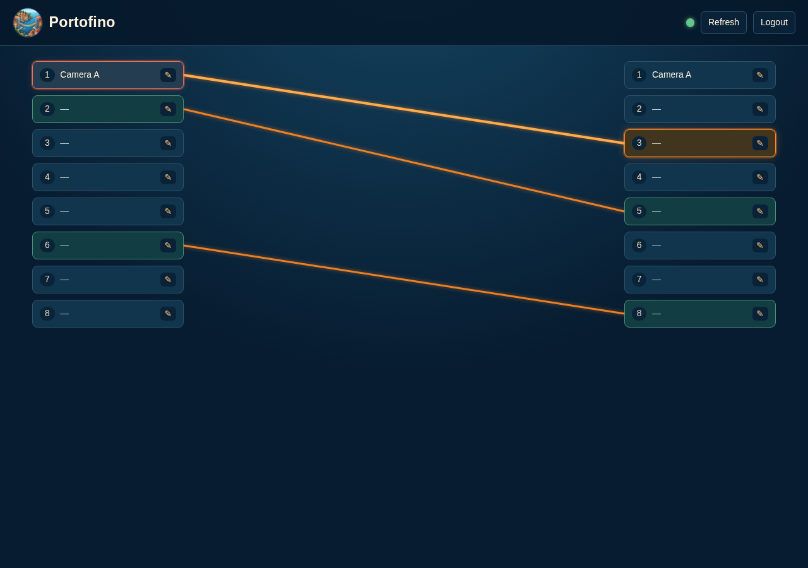

<p align="center">
  
</p>

<h1 align="center">Portofino</h1>

<p align="center">
  <b>A patch-panel controller for Intel Tofino.</b><br>
  Click two ports in a web UI &rarr; a P4 table entry cross-connects them in hardware.
</p>

<p align="center">
  
</p>

---

Portofino turns a Tofino switch into a remotely controlled **patch panel**: every
ingress port can be cross-connected to exactly one egress port, and every packet
arriving on a mapped port is forwarded to its counterpart — no L2/L3 lookups, no
learning, no config files on the switch. Ports with no mapping drop everything.

## Highlights

- **Strict 1:1 semantics.** One ingress maps to at most one egress and vice versa.
  Conflicting connections show a confirmation dialog naming exactly what would be
  replaced — in the UI and as HTTP 409 in the API. Mappings are unidirectional;
  self-connect (`1 -> 1`) is allowed.
- **The switch is the source of truth.** On startup Portofino clears its table and
  replays desired state onto the device; a Refresh pulls live device state back.
  Honest health/sync states (`in_sync`, `out_of_sync`, `partial_sync`,
  `unhealthy`) are surfaced in the UI and `GET /health`.
- **Zero build step, offline-friendly.** One Python process (FastAPI + Jinja2 +
  HTMX + ~80 lines of vanilla JS). No Node, no bundler, no compiler. Editing the
  app means editing `.py`/`.html`/`.js` and restarting uvicorn. Frontend deps are
  vendored into the repo.
- **Develop with no hardware at all.** A built-in fake backend emulates the device
  table in memory; the entire app, tests, and UI run on five pure-Python packages.
- **Real dataplane included.** A minimal TNA P4 program (one exact-match table)
  plus a BF Runtime (BFRT) gRPC backend, verified end to end against the Tofino
  model emulator — including actual packets following UI-created mappings.

## How it works

```
  Browser ──HTMX──►┌─────────────────────────────────────┐
                   │  FastAPI (one uvicorn process)      │
  Python client ──►│  • server-rendered patch-panel UI   │        ┌─────────────┐
  (REST + Basic)   │  • JSON REST API (session/Basic)    │──gRPC──►  Tofino 1   │
                   │  • Controller: asyncio.Lock, 1:1    │ (BFRT) │cross-connect│
                   │    invariant, health/sync states    │        │  P4 table   │
                   │  • JSON persistence (atomic writes) │        └─────────────┘
                   └─────────────────────────────────────┘
```

- The P4 program (`p4/portofino.p4`) has a single table: exact match on ingress
  device port, action sets the egress port, default action drops.
- The app translates between **UI port numbers** (1..N, what you see and label)
  and **device ports** via a JSON port map that must be a bijection.
- All mutations are serialized through one `asyncio.Lock`; device writes happen
  first, JSON persistence second. A failed persist degrades to `out_of_sync`
  rather than rolling back the device.

## Quickstart (no hardware)

Requires Python 3.9+.

```sh
git clone https://github.com/skittlebearz/portofino && cd portofino
python3 -m venv .venv
.venv/bin/pip install fastapi 'uvicorn[standard]' jinja2 python-multipart itsdangerous argon2-cffi
cp data/port_map.json.example data/port_map.json
cp data/mappings.json.example data/mappings.json

PORT_COUNT=8 \
MAPPINGS_FILE=data/mappings.json PORT_MAP_FILE=data/port_map.json AUTH_FILE=data/auth.json \
SESSION_SECRET=change-me BOOTSTRAP_USERNAME=admin BOOTSTRAP_PASSWORD=change-me \
TOFINO_BACKEND=fake \
.venv/bin/uvicorn app.main:app --host 127.0.0.1 --port 8000
```

Open http://127.0.0.1:8000/ui and log in with the bootstrap credentials (an
argon2-hashed auth file is created on first start; the plaintext is never stored).

**Using the panel:** click an ingress port (left), then an egress port (right) to
connect them. Click a connected pair to disconnect it. Edit the text field on any
port to label it. If a new connection conflicts with existing ones, a dialog
tells you exactly which mappings would be removed before anything changes.

## Running against a real Tofino / the emulator

The real backend speaks **BF Runtime gRPC** (`bfrt_grpc`, port 50052) to
`bf_switchd`, using the SDE's own Python client. Because `bfrt_grpc` and its
pinned protobuf ship inside the SDE, the recommended setup is to run Portofino
**where the SDE lives** (e.g. inside an [open-p4studio](https://github.com/p4lang/open-p4studio)
container) rather than matching gRPC versions on a separate host.

1. Compile the dataplane and start the model + switchd — see
   [`p4/README.md`](p4/README.md) for the exact commands and the SDE traps
   (artifact naming, readiness signals) they work around. `scripts/sde_run_app.sh`
   automates the whole thing: compile, boot, wait, then serve the UI.
2. Point the app at switchd:

```sh
TOFINO_BACKEND=bfrt \
TOFINO_GRPC_TARGET=localhost:50052 TOFINO_DEVICE_ID=0 TOFINO_PROGRAM_NAME=portofino \
PYTHONPATH="$SDE_INSTALL/lib/python3.10/site-packages/tofino:$PYTHONPATH" \
python3 -m uvicorn app.main:app --host 0.0.0.0 --port 8888
```

3. Optional, against the emulator: inject test traffic with
   `scripts/pf_scapy.py`, which speaks UI port numbers instead of veth names:

```sh
python3 scripts/pf_scapy.py send 1 --expect 2   # PASS if the mapping 1->2 exists
python3 scripts/pf_scapy.py watch               # print every packet on every port
```

`PORT_MAP_FILE` is where UI numbering meets reality: map each UI port to the
device port it patches (`{"1": 28, "2": 56, ...}`). The map must cover every UI
port and be one-to-one; anything else marks the app `unhealthy` at startup, and
an unhealthy app refuses device mutations rather than programming a switch with
a translation it knows is wrong.

## REST API

Same daemon, same auth (session cookie **or** HTTP Basic). All routes are JSON
except the HTMX `/ui/*` routes.

| Method | Path | Body | Notes |
|---|---|---|---|
| `GET` | `/health` | | `{"status","tofino_connected","sync_state"}` |
| `GET` | `/ports` | | port count + labels |
| `GET` | `/mappings` | | current cross-connects |
| `POST` | `/mappings` | `{"ingress":1,"egress":5,"force":false}` | `409` + `would_remove` on conflict; `force:true` applies it |
| `DELETE` | `/mappings` | `{"ingress":1,"egress":5}` | must name the exact pair |
| `POST` | `/refresh` | | re-read live state from the device |
| `GET` | `/labels` | | label map |
| `PUT` | `/labels/{port}` | `{"label":"Camera A"}` | |
| `POST` | `/login` / `/logout`, `GET` `/session` | form / — | session management |

Validation errors return `400` with a message; device/backend failures return
`503` (the app never hides a dead switch behind a 200).

A dependency-free Python client wraps all of it:

```python
from portofino_client import PortofinoClient, ConflictError  # client/portofino_client.py

pf = PortofinoClient("http://patchpanel:8000", "admin", "secret")
try:
    pf.connect(1, 5)
except ConflictError as e:
    print("would remove:", e.would_remove)
    pf.connect(1, 5, force=True)
```

## Configuration

Everything is environment variables — no config file for the app itself.

| Variable | Meaning | Default |
|---|---|---|
| `PORT_COUNT` | number of UI ports per column | `8` |
| `MAPPINGS_FILE` | desired state + labels (JSON, written atomically) | `data/mappings.json` |
| `PORT_MAP_FILE` | UI&rarr;device port bijection (JSON) | `data/port_map.json` |
| `AUTH_FILE` | single user, argon2 hash (bootstrapped on first run) | `data/auth.json` |
| `SESSION_SECRET` | cookie signing key — set a real one | dev value |
| `BOOTSTRAP_USERNAME` / `BOOTSTRAP_PASSWORD` | first-run credentials | `admin` / `admin` |
| `TOFINO_BACKEND` | `fake` or `bfrt` (`p4runtime` reserved) | `fake` |
| `TOFINO_GRPC_TARGET` / `TOFINO_DEVICE_ID` / `TOFINO_PROGRAM_NAME` | switchd connection (bfrt only) | `127.0.0.1:50051` / `0` / `portofino` |

## Development & tests

```sh
.venv/bin/pip install pytest pytest-asyncio httpx
.venv/bin/python -m pytest                 # 54 tests: 1:1 semantics, API, UI routes,
                                           # client integration, failure states
.venv/bin/pip install playwright           # optional, uses your system chromium
.venv/bin/python scripts/ui_verify.py      # drives the real UI headless: clicks,
                                           # conflict dialog, SVG lines, redraws
bash scripts/sde_verify.sh                 # inside the SDE container: full backend +
                                           # controller acceptance against tofino-model
```

The canonical behavior test: with `1->2` and `7->5` mapped, requesting `1->5`
must remove **both** and add `1->5` — and refuse to do so without `force`.

## Deployment

Ship the source tree + a venv; run under systemd (`portofino.service` included).
There is deliberately nothing to build on the target machine.

## Repository layout

```
app/            FastAPI app: controller, stores, auth, routes, templates, static
  tofino/       device backends: fake (in-memory) and bfrt (BF Runtime gRPC)
client/         stdlib-only Python REST client
p4/             TNA dataplane, switchd conf, build/run notes
scripts/        verification harnesses + SDE playground launcher + scapy helper
tests/          acceptance tests (pytest)
data/           example port map / mappings files
```

